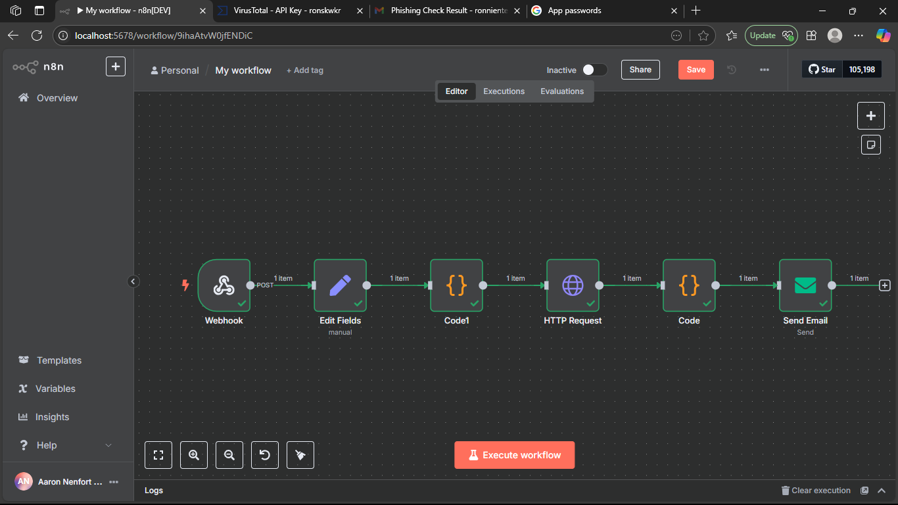

# 🛡️ n8n Phishing URL Checker (VirusTotal API)

This project uses n8n to detect whether a submitted URL is malicious, suspicious, or harmless using the VirusTotal API.

---

## 🔍 Features

- Accepts URLs via a public webhook
- Sends URLs to VirusTotal for analysis
- Extracts scan results (harmless, suspicious, malicious)
- Sends an email with the final report

---

## 🧱 Tools Used

- n8n (Self-hosted)
- VirusTotal API
- Gmail SMTP
- curl (for testing the webhook)

---

## 🧪 How It Works

### 1. Webhook  
Receives input like:
```json
{
  "suspicious_url": "http://example.com/phish"
}
```

### 2. Function Node  
Encodes the URL using:
```javascript
Buffer.from(url).toString("base64")
```

### 3. HTTP Request  
Sends the encoded URL to:
```
https://www.virustotal.com/api/v3/urls/{{encoded_url}}
```
With header:
```
x-apikey: YOUR_API_KEY
```

### 4. Set Node  
Extracts the following fields:
- `data.attributes.last_analysis_stats.malicious`
- `suspicious`
- `harmless`
- `undetected`

### 5. Email Node  
Sends the result to your email.

---

## 🔁 Sample Output
```
Malicious: 0  
Suspicious: 0  
Harmless: 85  
Undetected: 8
```

---

## 📷 Workflow



---

## ▶️ Running the Workflow

1. Clone this repo
2. Import `workflow.json` into n8n
3. Replace email and API credentials in nodes
4. Start the workflow in test mode
5. Trigger using curl:
```bash
curl -X POST http://localhost:5678/webhook-test/phishing-check \
  -H "Content-Type: application/json" \
  -d '{"suspicious_url": "http://example.com/phish"}'
```

---

## 🛠️ Setup Notes

- You need a Gmail **App Password** (not your normal password)
- VirusTotal free tier has request limits (4/minute)

---

## 📁 Files

- `workflow.json` – Exported n8n logic
- `sample_payload.json` – Sample webhook input
- `images/flow-diagram.png` – Screenshot of workflow
